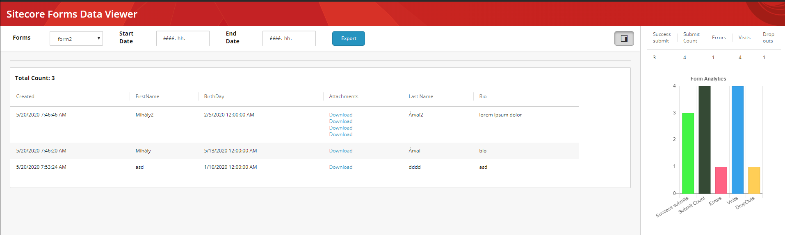
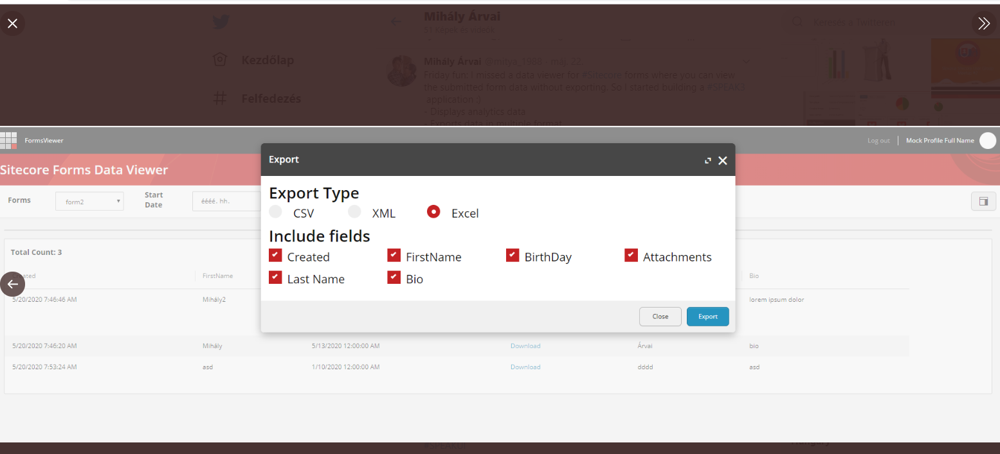

# Sitecore Forms Data Viewer
The repository contains source code and documentation for the Sitecore Forms Data Viewer

# Table of Contents
* [Introduction](#Introduction)
    * [Purpose](#Purpose)
    * [Supported Sitecore Versions](#Supported-Sitecore-Versions) 
    * [Releases](#Releases)
    * [Installation](#Installation)
        * [ConfigurationFiles](#Configuration-files)

# Introduction

TODO

* [BlogPost](https://tinyurl.com/ybq26ay8)

## Purpose
Ability to display Sitecore Forms submitted data and analytics data. It gives ability to download the submitted files too.

## Supported Sitecore Versions

- Sitecore 9.0
- Sitecore 9.0 Update-1
- Sitecore 9.0 Update-2
- Sitecore 9.1 
- Sitecore 9.1 Update-1
- Sitecore 9.2
- Sitecore 9.3 

## Releases
- 1.0-beta  - [package](sc.package/Sitecore.Forms.DataViewer-1.0-beta.zip)
  - Initial Release

## Installation

Provide detailed instructions on how to install the module, and include screenshots where necessary.

1. Use the Sitecore Installation wizard to install the [package](sc.package/Sitecore.Forms.DataViewer-1.0-beta.zip)
   2. The package contains **DocumentFormat.OpenXml** binary. If your solution already contains it, you can skip this file. (Sitecore Instances above 9.1 contains this dll)
2. Make sure if your search indexes are working correctly
3. Go the LaunchPad and open the Forms Data Viewer

### Configuration files
The package contains a configuration patch, which sets the "Sitecore.Services.SecurityPolicy" to "ServicesOnPolicy" - it is required for the service on Azure.

**Settings in the Sitecore.FormsViewer.config**

## Screenshots

# Configure the developer environment

If you want to enhance or contribute into the module, you should perform the following steps to setup the codebase locally.

## How to setup the API
* It should work with Sitecore 9.0, 9.1, 9.2, 9.3
* Build the FormsViewer.Service.sln Visual Studio Solution. 
* Copy the **FormsViewer.Service.dll** and pdb files into your Sitecore's bin folder. 
* Copy the Configuration files from the FormsViewer.Service\App_Config\Include\FormsViewer folder into your Sitecore instance
* Sync the items with Unicorn

## How to setup the client Application
- go to the \src\FormsViewer.Client\ folder
- make sure you are using node version 8.x
- run "npm install" in the folder
- run "npm run build" command
- Copy the DIST folder content to \sitecore\shell\client\Applications\formsviewer\ (Create the formsviewer folder)
- Open in http://sc.local/sitecore/shell/client/Applications/formsviewer/ url

